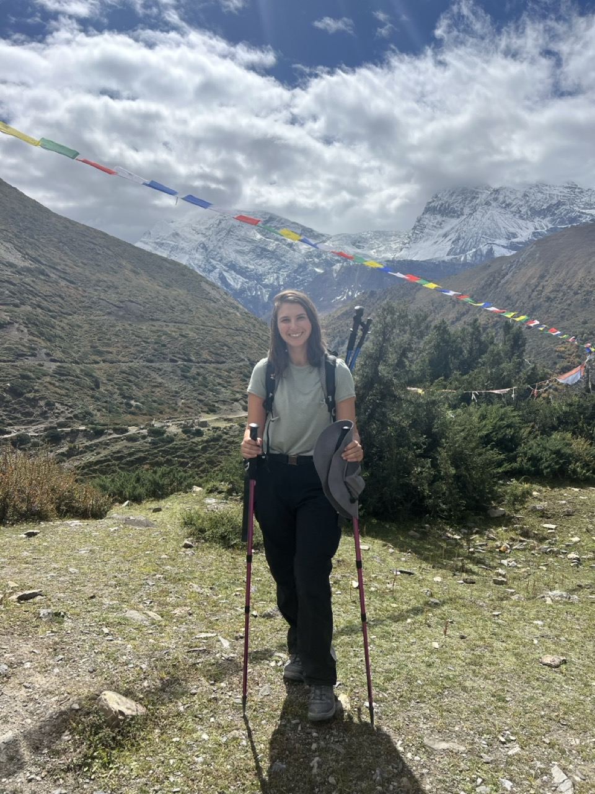
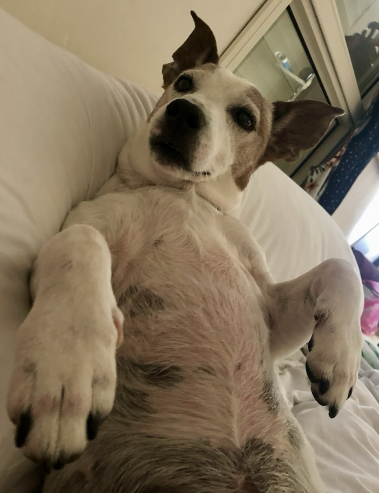

  

## Education 🎓 
* B.Sc. in Life-Science, Ben-Gurion University
* Currently I am a student in [Weizmann Institute](https://www.weizmann.ac.il/pages/)
* My first rotation is in [Eyal Karzbrun lab](https://www.karzbrunlab.com/), studying how organs gain their shape

## About me 👩🏽‍🔬
* I love traveling around the world and in Israel
* I love spending time with my family and friends
* I love animals, especially my dog Jack 🐶

 

## WIS Python programming course 👩🏽‍💻
* Taking Python programming course 2025 with [Gábor Szabó](https://szabgab.com/)
* See [my repository](https://github.com/Lihierez/Lihierez.github.io)

## Contact me 

